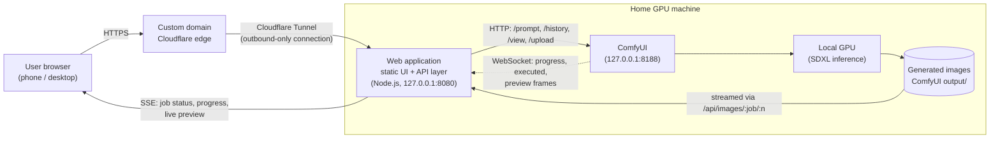
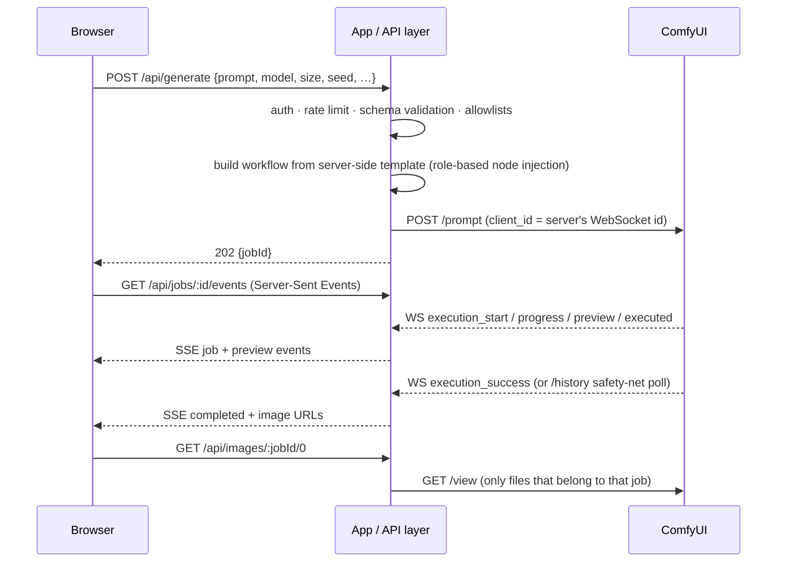

# ComfyUI Mobile Studio

[한국어](README.md) | **English**

A mobile-first web application for generative AI images that uses **ComfyUI as a local GPU inference backend**.

The browser never talks to ComfyUI. A small Node.js application layer exposes only the features the UI needs, injects validated parameters into a server-side workflow, follows execution over ComfyUI's WebSocket and streams progress back to the browser.


## Overview

ComfyUI is a powerful node-based engine for Stable Diffusion, but its graph editor is built for power users on a desktop screen. I wanted to generate images from my phone — on the couch or outside — while the actual inference runs on my own GPU at home.

This project started as a personal mobile client for ComfyUI. This repository is its **portfolio edition**: the core generation pipeline, rebuilt around a proper security boundary so it can be shown publicly on a custom domain:

- a clean, touch-friendly UI (prompt, style presets, model/LoRA selection, sampling settings, pose reference, gallery)
- an **application/API layer** between the public internet and ComfyUI
- remote access through **Cloudflare Tunnel** — no router port forwarding, HTTPS by default, ComfyUI never exposed

## Architecture



Request flow for one image:



More detail: [docs/architecture.en.md](docs/architecture.en.md).

## Features

Everything listed here is implemented in this repository.

**Interface**
- Korean by default, switchable to English in one tap (UI texts, presets, progress stages and server error messages all follow the selected language)

**Generation**
- Prompt and negative prompt, with a *prompt helper* (clickable keyword chips by category)
- Style presets: portrait, landscape, illustration, cinematic, product, anime-style, concept art — optionally applying recommended steps / CFG / size
- Checkpoint selection and up to N LoRAs with per-LoRA strength (lists come from ComfyUI, limited to a dedicated portfolio folder)
- Image size presets (SDXL aspect ratios), batch size, seed (random / fixed / reuse last), steps, CFG
- *Advanced Settings*: sampler & scheduler (lists read from ComfyUI), optional hires-fix second pass
- Optional pose / reference image via ControlNet: upload an image, or **draw a pose** in the built-in OpenPose skeleton editor; optional pose extraction from photos

**Monitoring & results**
- Server status pill: **Online / Offline / Generating**
- Live progress: current stage (node title), step counter, elapsed time, queue position
- Live preview frames relayed from ComfyUI during sampling
- Result view with download, details and parameter summary
- Recent-results gallery (server-side, persists across restarts) with details dialog, download, *use these settings* and hide

**Reliability & security**
- Access-token sign-in → HttpOnly, SameSite=Strict, HMAC-signed session cookie
- One generation at a time with a short waiting line; rate limits for generation, uploads and sign-in
- Fixed request schema: unknown fields (e.g. `workflow`) are rejected; models, samplers and sizes must be on the published catalog
- Activity-based job timeout, `/history` polling as a safety net for missed WebSocket messages, cancel support
- Clear handling of ComfyUI being offline, WebSocket reconnects (exponential backoff), SSE → polling fallback in the browser
- Duplicate-click protection, error messages shown in the UI with *Try again*

## Tech Stack

| Layer | Technology |
|---|---|
| Frontend | HTML, CSS (design tokens, light/dark), vanilla JavaScript ES modules, `EventSource` (SSE), Canvas (pose editor) |
| Application / API | Node.js 22 — `node:http`, built-in `fetch` / `WebSocket` / `FormData`; **no runtime npm dependencies** |
| Inference backend | ComfyUI HTTP API + WebSocket, API-format workflow JSON |
| Models | Stable Diffusion XL checkpoints (any model `CheckpointLoaderSimple` can load), LoRA, optional ControlNet (OpenPose) |
| Remote access | Cloudflare Tunnel (`cloudflared`) + custom domain |
| Testing | `node:test` — unit tests + end-to-end tests against a mock ComfyUI (HTTP + WebSocket) |

## Screenshots

| Main UI | Generation progress |
|---|---|
|  |  |

| Generated result | Mobile UI |
|---|---|
|  |  |

## Installation

Requirements: **Node.js 22+**, a working **ComfyUI** install with an NVIDIA GPU (or any backend ComfyUI supports), and at least one SDXL checkpoint.

### Windows — one click

| File | What it does |
|---|---|
| `start-demo.bat` | Starts ComfyUI (if `COMFYUI_DIR` is set and it isn't running yet, bound to localhost), waits until it answers, starts the web app and — when `CLOUDFLARE_TUNNEL_TOKEN` is set — the Cloudflare Tunnel, then opens the browser. |
| `start.bat` | Starts only the web app in the current window (ComfyUI already running). |
| `test.bat` | Runs the test suite and the workflow check. |
| `models.bat` | Lists the checkpoints / LoRAs ComfyUI can see (ComfyUI must be running), marks the ones the app publishes, and opens `config/models.json` for optional display names / defaults. |

On the first run the launcher creates `.env` with a random `ACCESS_TOKEN` / `SESSION_SECRET` (the token is printed once) and `config/models.json`, then opens `.env` in Notepad. Set `COMFYUI_DIR` to your ComfyUI portable folder, put the demo models into the `portfolio` sub-folders (see [ComfyUI Setup](#comfyui-setup)), and run `start-demo.bat` again.

### Any OS — manually

```bash
# 1. Get the code
git clone https://github.com/Bong0524/comfyui-mobile-studio.git
cd comfyui-mobile-studio

# 2. Configure: creates .env (random ACCESS_TOKEN / SESSION_SECRET) and config/models.json
npm run setup
#    then put the demo models into models/checkpoints/portfolio/ and models/loras/portfolio/ and review .env

# 3. Check that the workflow template is usable
npm run workflow:check

# 4. Start ComfyUI (see "ComfyUI Setup"), then the app
npm start
# → open http://127.0.0.1:8080 and sign in with ACCESS_TOKEN
```

There is nothing to `npm install` for running the app. `npm test` runs the test suite (also dependency-free).

**No GPU at hand?** `npm run mock` starts a mock ComfyUI on port 8199 that returns procedural gradient images — useful for UI work and for the tests. Point `COMFYUI_URL=http://127.0.0.1:8199` at it.

## Configuration

All settings live in `.env` (git-ignored); `.env.example` documents every key. The important ones:

| Key | Purpose |
|---|---|
| `APP_HOST`, `APP_PORT` | Where the web app listens. Keep `127.0.0.1` — the tunnel connects locally. |
| `DOMAIN` / `PUBLIC_ORIGIN` | Public hostname. Used for the Origin (CSRF) check and `Secure` cookies. |
| `TRUST_PROXY` | `true` behind Cloudflare Tunnel so rate limits use the real client IP (`CF-Connecting-IP`). |
| `COMFYUI_URL`, `COMFYUI_WS_URL` | ComfyUI address (loopback). WS URL is derived when empty. |
| `ACCESS_TOKEN` | **Required.** Sign-in password for visitors (≥ 8 chars). The server refuses to start without it. |
| `SESSION_SECRET` | Signs session cookies. Set it so sessions survive restarts. |
| `API_KEY` | Optional bearer key for scripted access. |
| `MODEL_LIST_MODE`, `MODEL_FOLDER`, `MODELS_CONFIG` | `folder` (default) publishes only models inside the dedicated sub-folder `MODEL_FOLDER` (`portfolio`) plus anything listed in `config/models.json`. `allowlist` publishes only the listed ones, `all` everything ComfyUI has. Only models ComfyUI actually has are ever shown. |
| `MAX_*`, `*_RATE_LIMIT_PER_MIN`, `MAX_PENDING_JOBS` | Demo limits (steps, pixels, batch, LoRAs, upload size, queue). |
| `JOB_IDLE_TIMEOUT_SEC`, `JOB_MAX_DURATION_SEC` | Inactivity timeout and hard ceiling per job. |
| `SAFETY_NEGATIVE`, `BLOCKED_TERMS_FILE` | A phrase always appended to the negative prompt; prompts containing a listed term are rejected (both optional; copy `config/blocked-terms.example.txt`, the real list stays out of Git). |
| `CONTROLNET_MODEL`, `CONTROLNET_PREPROCESSOR` | Enable the pose/reference feature (see below). |
| `CLOUDFLARE_TUNNEL_TOKEN` | Used only by `npm run tunnel` / `start-demo.bat`. |
| `COMFYUI_DIR`, `COMFYUI_EXTRA_ARGS` | Used only by `start-demo.bat` to launch ComfyUI portable (never with `--listen`). |

`config/` also holds the style presets (`style-presets.json`), prompt-helper keywords (`prompt-tags.json`) and an example blocked-terms list (`blocked-terms.example.txt`) — all editable without touching code.

## ComfyUI Setup

1. Install ComfyUI and start it **bound to localhost** (the default — do not add `--listen`). Live previews need a preview method:

   ```bash
   python main.py --preview-method auto          # Windows portable: add to run_nvidia_gpu.bat
   ```
   No `--enable-cors-header` is needed: the browser never calls ComfyUI directly.

2. **Models live in ComfyUI, not in this repository — in a dedicated `portfolio` sub-folder.** The app only publishes models from that sub-folder, so other models in the same ComfyUI install never show up in the demo:

   ```text
   <ComfyUI model folder>/            ComfyUI/models/ or the folder extra_model_paths.yaml points to
   ├─ checkpoints/portfolio/          SDXL checkpoints for the demo
   ├─ loras/portfolio/                LoRAs for the demo
   └─ controlnet/                     OpenPose ControlNet (optional, CONTROLNET_MODEL)
   ```

   Restart ComfyUI after adding files, then run `models.bat` / `npm run models` to check what is published (✓). Display names, the default model and LoRA strength can optionally be set in `config/models.json` (e.g. `"portfolio\\model.safetensors"` on Windows). Change the folder name with `MODEL_FOLDER`.

3. **Workflow** — `workflows/txt2img.api.json` uses **core nodes only**, so no custom nodes are required:

   `CheckpointLoaderSimple → CLIPTextEncode (+/−) → EmptyLatentImage → KSampler → LatentUpscaleBy → KSampler (hires) → VAEDecode → SaveImage`

   LoRA (`LoraLoader`) and ControlNet (`ControlNetLoader`, `ControlNetApplyAdvanced`, `LoadImage`) nodes are inserted by the server only when requested. The hires branch is pruned when disabled.

   You can replace the template with your own export (*Workflow → Export (API)*). Nodes are located **by role in the graph, not by id**; run `npm run workflow:check path/to/file.json` to see what was detected.

4. **Optional — pose / reference image**
   - Download an SDXL OpenPose ControlNet into `models/controlnet/` and set `CONTROLNET_MODEL` to its file name.
   - For *extract the pose from a photo*, install the custom node pack **comfyui_controlnet_aux** (provides `OpenposePreprocessor`) and set `CONTROLNET_PREPROCESSOR=openpose`.
   - The drawn-pose editor needs no custom nodes (the skeleton image is used directly).

## Remote Demo

Goal: `https://<your-demo-domain>` → Cloudflare Tunnel → `http://127.0.0.1:8080` (this app). ComfyUI stays on `127.0.0.1:8188` and is **not** published.

1. Add your domain to Cloudflare (free plan is enough).
2. Install `cloudflared` on the GPU machine.
3. In **Cloudflare Zero Trust → Networks → Tunnels**, create a tunnel (type *Cloudflared*). Copy the token shown in the install step into `.env` as `CLOUDFLARE_TUNNEL_TOKEN`.
4. Under **Public Hostname**, add `demo.<your-domain>` → service `HTTP` → `127.0.0.1:8080`. Do not add a route for port 8188.
5. In `.env` set `DOMAIN=demo.<your-domain>` and `TRUST_PROXY=true`, then:

   ```bash
   npm start          # terminal 1 — the app
   npm run tunnel     # terminal 2 — cloudflared (token passed via env, not argv)
   ```

The tunnel is an outbound connection from your machine, so **no port forwarding** is needed and TLS is handled by Cloudflare. A locally-managed alternative (config file + credentials JSON) is in [deploy/cloudflared/config.example.yml](deploy/cloudflared/config.example.yml).

Optional hardening: put a **Cloudflare Access** policy (e.g. one-time PIN to specific emails) in front of the hostname for a second layer of authentication.

## Security

The design principle is a **security boundary between the public app and ComfyUI**:

- **ComfyUI is never exposed.** It listens on loopback only and has no tunnel route. Its API can run arbitrary workflows, read/write files in its folders and load any model — so it must not be reachable from the internet.
- **No proxying of the ComfyUI API.** The app offers a small purpose-built API (`/api/generate`, `/api/jobs/…`, `/api/images/…`, `/api/uploads`). There is no generic pass-through.
- **No client-supplied workflows.** Requests follow a fixed schema; unknown keys are rejected. The graph comes from the server-side template, and values are injected only into the nodes the server resolved.
- **Allowlists for everything that becomes a file name**: checkpoints, LoRAs, samplers, schedulers, sizes, presets. Output paths are generated by the server; images are served by `jobId/index`, never by file name. Uploads are type-checked by magic bytes and renamed randomly.
- **Authentication**: access token → HMAC-signed HttpOnly `SameSite=Strict` cookie; constant-time comparisons; sign-in rate limit. The server refuses to start without `ACCESS_TOKEN` (unless explicitly in loopback-only dev mode).
- **CSRF**: state-changing requests must carry the app's own `Origin`.
- **Resource protection**: one GPU job at a time + bounded queue, per-IP rate limits, step/pixel/batch/LoRA/upload caps, job timeouts.
- **Content settings**: a negative phrase the server always appends and a blocked-terms list, both set by the operator on the host and kept out of Git.
- **Headers**: strict CSP (`default-src 'self'`, no inline scripts), `X-Frame-Options: DENY`, `nosniff`, `Referrer-Policy: no-referrer`.
- **Secrets** live only in `.env` (git-ignored); the tunnel token is passed to `cloudflared` through its environment, not the command line.

## Project Structure

```
comfyui-mobile-studio/
├─ server/                    Application / API layer (Node.js, no dependencies)
│  ├─ index.js                entry point (reads .env, starts the app)
│  ├─ app.js                  routes, SSE, image proxy, static files
│  ├─ config.js               env parsing + validation (refuses unsafe configs)
│  ├─ security.js             sign-in, signed sessions, rate limits, Origin check
│  ├─ catalog.js              models/LoRAs/samplers (ComfyUI ∩ portfolio folder), presets
│  ├─ job-manager.js          single-GPU queue, WebSocket event handling, timeouts
│  ├─ history-store.js        recent-results gallery (data/history.json)
│  ├─ uploads.js              reference-image uploads (magic-byte check, random names)
│  ├─ static.js               static file serving for public/
│  ├─ comfy/client.js         ComfyUI HTTP client
│  ├─ comfy/monitor.js        persistent ComfyUI WebSocket (auto-reconnect)
│  └─ workflow/
│     ├─ resolve-nodes.js     find nodes by role in the graph
│     ├─ build-workflow.js    parameter injection, LoRA chain, ControlNet, hires pruning
│     └─ validate.js          request schema + limits + allowlists
├─ public/                    Web UI (HTML/CSS/ES modules)
│  ├─ index.html
│  ├─ css/tokens.css, app.css
│  └─ js/ main · api · i18n (ko/en) · status · form · generate · gallery · reference · pose-editor · ui
├─ workflows/txt2img.api.json ComfyUI workflow template (core nodes only)
├─ config/                    style presets, prompt tags, model allowlist example, blocked-terms example
├─ start-demo.bat            Windows: ComfyUI + app + tunnel + browser in one click
├─ start.bat · test.bat       Windows: app only / run tests
├─ models.bat                 Windows: list ComfyUI models, edit the allowlist
├─ scripts/                   mock ComfyUI, tunnel launcher, workflow checker, first-run setup,
│                             helpers for the .bat launchers (env-get, wait-for, check-setup, say = Korean console messages)
├─ test/                      unit + end-to-end tests (node:test)
├─ deploy/cloudflared/        locally-managed tunnel config example (no credentials)
├─ docs/architecture*.md      detailed architecture and data flow (Korean / English)
└─ assets/screenshots/        README images
```

## Testing

```bash
npm test
```

27 tests: workflow role detection (including a renumbered graph), parameter injection, LoRA rewiring, ControlNet insertion, request validation, session signing, config safety, and end-to-end runs against the mock ComfyUI (sign-in, SSE progress, live preview, image proxy, gallery, uploads, cancel, queue limit, backend error, backend offline).

## Future Improvements

- Persistent job queue (survives restarts) and multi-user fairness
- Multiple GPUs / multiple ComfyUI workers behind the job manager
- Real user accounts (OAuth or Cloudflare Access identity) instead of a shared token
- Per-user galleries and storage quotas
- Image-to-image and inpainting workflows (the original personal version has them)
- Cloud GPU deployment option (container + managed GPU instance)
- Automated screenshot/visual regression tests in CI

## License

The source code in this repository is released under the **MIT License** — see [LICENSE](LICENSE).

Notes on third-party components:
- **ComfyUI** is licensed under **GPL-3.0**. This project does not include, modify or link ComfyUI code; it talks to a separately installed ComfyUI process over its network API, so it can be MIT-licensed. If you redistribute ComfyUI itself, its GPL terms apply to that distribution.
- **Model weights** (SDXL checkpoints, LoRAs, ControlNet models) are **not** part of this repository. Each model has its own license (e.g. CreativeML Open RAIL++-M for SDXL base, other licenses for community fine-tunes) — check them before using a model in a public demo, especially for commercial use.
- Optional custom nodes (e.g. `comfyui_controlnet_aux`) are installed separately and keep their own licenses.
