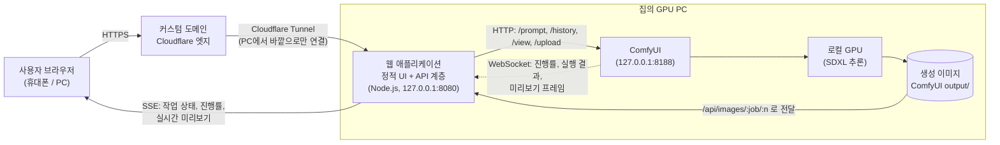
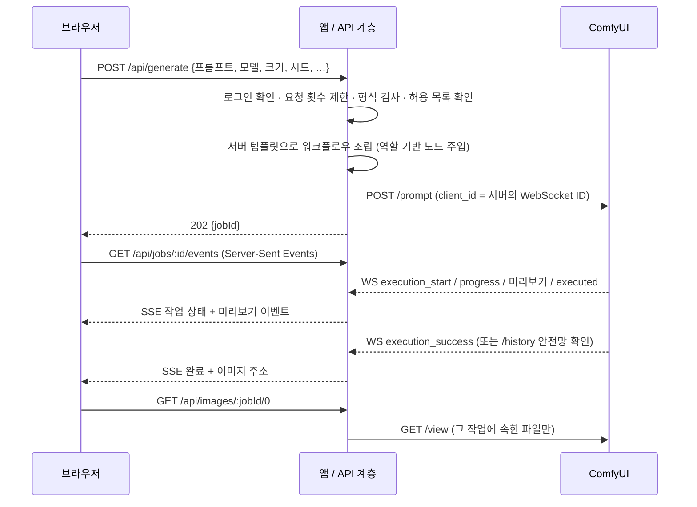

# ComfyUI Mobile Studio

**한국어** | [English](README.en.md)

**ComfyUI를 로컬 GPU 추론 백엔드로 사용하는** 모바일 우선 생성형 AI 이미지 웹 애플리케이션입니다.

브라우저는 ComfyUI와 직접 통신하지 않습니다. 가운데에 있는 Node.js 애플리케이션 계층이 화면에 필요한 기능만 API로 열고, 검증한 파라미터를 서버 쪽 워크플로우에 주입합니다. 실행 과정은 ComfyUI WebSocket으로 받아서 진행 상황을 브라우저로 실시간 전달합니다.


## 개요 (Overview)

ComfyUI는 Stable Diffusion을 다루는 강력한 노드 기반 엔진이지만, 그래프 편집기는 데스크톱 화면의 숙련자에게 맞춰져 있습니다. 저는 실제 추론은 집에 있는 제 GPU에서 돌리고, 휴대폰으로 소파에서든 밖에서든 쉽게 이미지를 만들고 싶었습니다.

이 프로젝트는 개인용 모바일 ComfyUI 클라이언트로 시작했습니다. 이 저장소는 그 **포트폴리오 공개용 버전**으로, 핵심 생성 파이프라인을 제대로 된 보안 경계 위에 다시 구성해 커스텀 도메인으로 공개할 수 있게 만들었습니다.

- 터치하기 편한 깔끔한 UI (프롬프트, 스타일 프리셋, 모델·LoRA 선택, 샘플링 설정, 포즈 참조, 갤러리)
- 인터넷과 ComfyUI 사이에 둔 **애플리케이션/API 계층**
- **Cloudflare Tunnel** 기반 원격 접속 — 공유기 포트포워딩 없이 기본으로 HTTPS, ComfyUI는 외부에 노출하지 않음

## 아키텍처 (Architecture)



이미지 한 장이 만들어지는 흐름:



더 자세한 설명: [docs/architecture.md](docs/architecture.md)

## 기능 (Features)

아래 기능은 모두 이 저장소에 실제로 구현되어 있습니다.

**화면**
- 기본은 한국어, 버튼 하나로 English 전환 (화면 문구, 프리셋, 진행 단계, 서버 오류 메시지가 모두 선택한 언어를 따름)

**생성**
- 프롬프트와 네거티브 프롬프트, 누르면 추가되는 *프롬프트 도우미*(분류별 키워드 칩)
- 스타일 프리셋: 인물, 풍경, 일러스트, 시네마틱, 제품, 애니메이션, 컨셉 아트 — 추천 스텝·CFG·크기도 함께 적용 가능
- 체크포인트 선택, LoRA 여러 개와 개별 강도 (목록은 ComfyUI에서 받아 포트폴리오 전용 폴더로 거름)
- 이미지 크기 프리셋(SDXL 화면비), 생성 개수, 시드(랜덤 / 고정 / 이전 시드 재사용), 스텝, CFG
- *고급 설정*: 샘플러·스케줄러(ComfyUI에서 목록을 받음), 선택형 Hires fix 2차 생성
- 선택 기능 — ControlNet 포즈·참조 이미지: 이미지 업로드, 또는 내장 OpenPose 뼈대 에디터로 **포즈 직접 그리기**, 사진에서 포즈 추출

**한/영 태그 사전** (원본 앱에서 옮김)
- 자동완성: 영어 태그, 한국어 별칭(`긴 머리` → `long hair`), 초성(`ㄱㅁㄹ`)으로 찾고 ↑↓·Enter·Tab으로 넣기, 이미 있는 태그는 알려 줌
- 프롬프트 칩: 프롬프트를 태그 단위 칩으로 보여 주고 한국어 이름을 함께 표시, 눌러서 강조(가중치) · 순서 · 삭제
- 사전 탐색: 주체 › 외형 › 머리카락 같은 분류를 따라가거나 검색해서 프롬프트 · 네거티브에 넣기
- 사전 데이터: 원본 앱의 한/영 사전에서 분류 · 한국어 별칭 · 설명이 **모두 갖춰진 일반 태그 10,100개** ([태그 사전 데이터](#태그-사전-데이터-tag-dictionary-data))

**진행 상황 · 결과**
- 서버 상태 표시: **온라인 / 오프라인 / 생성 중**
- 실시간 진행률: 현재 단계, 스텝 수, 경과 시간, 대기 순서
- 샘플링 중 ComfyUI가 보내는 실시간 미리보기
- 결과 화면: 다운로드, 상세 정보, 설정 요약
- 최근 생성 결과 갤러리 (서버에 저장되어 재시작 후에도 유지): 상세 창, 다운로드, *이 설정으로 다시 만들기*, 숨기기

**안정성 · 보안**
- 접속 비밀번호 로그인 → HttpOnly · SameSite=Strict · HMAC 서명 세션 쿠키
- 한 번에 1건만 생성 + 짧은 대기열, 생성·업로드·로그인 요청 횟수 제한
- 정해진 요청 형식: 모르는 항목(예: `workflow`)은 거절, 모델·샘플러·크기는 공개된 목록에 있어야 함
- 활동 기반 시간 제한, WebSocket 메시지를 놓쳤을 때를 위한 `/history` 확인, 취소 기능
- ComfyUI 꺼짐 처리, WebSocket 자동 재연결(간격을 늘려 가며), 브라우저의 SSE → 폴링 대체 경로
- 중복 클릭 방지, 오류 메시지 화면 표시와 *다시 시도*

## 기술 스택 (Tech Stack)

| 영역 | 기술 |
|---|---|
| 프론트엔드 | HTML, CSS(디자인 토큰, 라이트/다크), 순수 JavaScript ES 모듈, `EventSource`(SSE), Canvas(포즈 에디터) |
| 애플리케이션 / API | Node.js 22 — `node:http`, 내장 `fetch` / `WebSocket` / `FormData`, **실행용 npm 의존성 없음** |
| 추론 백엔드 | ComfyUI HTTP API + WebSocket, API 형식 워크플로우 JSON |
| 모델 | Stable Diffusion XL 체크포인트(`CheckpointLoaderSimple`로 불러올 수 있는 모델), LoRA, 선택형 ControlNet(OpenPose) |
| 원격 접속 | Cloudflare Tunnel(`cloudflared`) + 커스텀 도메인 |
| 테스트 | `node:test` — 단위 테스트 + 가짜 ComfyUI(HTTP + WebSocket)를 상대로 한 통합 테스트 |

## 스크린샷 (Screenshots)

| 메인 화면 | 생성 진행 |
|---|---|
|  |  |

| 생성 결과 | 모바일 화면 |
|---|---|
|  |  |

## 설치 (Installation)

필요한 것: **Node.js 22 이상**, NVIDIA GPU에서 동작하는 **ComfyUI**(또는 ComfyUI가 지원하는 다른 환경), SDXL 체크포인트 1개 이상.

### Windows — 더블클릭으로 실행

| 파일 | 하는 일 |
|---|---|
| `start-demo.bat` | ComfyUI를 켜고(`COMFYUI_DIR`이 설정돼 있고 꺼져 있을 때, 이 PC 안에서만 접속되게) 응답할 때까지 기다린 뒤, 웹앱을 켜고, `CLOUDFLARE_TUNNEL_TOKEN`이 있으면 Cloudflare Tunnel까지 켜고 브라우저를 엽니다. |
| `start.bat` | ComfyUI가 이미 켜져 있을 때 웹앱만 현재 창에서 실행합니다. |
| `test.bat` | 테스트와 워크플로우 점검을 실행합니다. |
| `models.bat` | ComfyUI가 인식한 체크포인트·LoRA 목록을 보여 주고(ComfyUI가 켜져 있어야 함) 그중 앱에 공개되는 모델을 ✓로 표시한 뒤, 표시 이름·기본 모델을 바꿀 수 있게 `config/models.json`을 엽니다(선택). |

처음 실행하면 `.env`(랜덤 `ACCESS_TOKEN` · `SESSION_SECRET`, 비밀번호는 한 번 화면에 표시)와 `config/models.json`이 자동으로 만들어지고, 메모장으로 `.env`가 열립니다. `COMFYUI_DIR`에 ComfyUI 포터블 폴더를 적고(비워 두면 드라이브에서 찾아봅니다), 데모용 모델을 `portfolio` 전용 폴더에 넣은 뒤([ComfyUI 설정](#comfyui-설정-comfyui-setup) 참고) `start-demo.bat`을 다시 실행하세요.

### 다른 OS — 직접 실행

```bash
# 1. 코드 받기
git clone https://github.com/Bong0524/comfyui-mobile-studio.git
cd comfyui-mobile-studio

# 2. 설정: .env(랜덤 ACCESS_TOKEN / SESSION_SECRET)와 config/models.json 생성
npm run setup
#    그다음 config/models.json 에 데모용 모델을 적고 .env 를 확인

# 3. 워크플로우 템플릿 점검
npm run workflow:check

# 4. ComfyUI 를 켠 뒤("ComfyUI 설정" 참고) 앱 실행
npm start
# → http://127.0.0.1:8080 에 접속해 ACCESS_TOKEN 으로 로그인
```

실행을 위해 `npm install`할 것은 없습니다. `npm test`로 테스트를 돌릴 수 있습니다(역시 의존성 없음).

**GPU가 없을 때:** `npm run mock`을 실행하면 8199 포트에 가짜 ComfyUI가 뜨고 단순한 그라데이션 이미지를 돌려줍니다. 화면 작업이나 테스트용이며, `COMFYUI_URL=http://127.0.0.1:8199`로 연결하면 됩니다.

## 설정 (Configuration)

모든 설정은 `.env`(git에 올라가지 않음)에 있고, 전체 항목은 `.env.example`에 설명되어 있습니다. 주요 항목:

| 항목 | 용도 |
|---|---|
| `APP_HOST`, `APP_PORT` | 웹앱이 열리는 주소. `127.0.0.1` 그대로 두세요 — 터널은 이 PC 안에서 연결합니다. |
| `DOMAIN` / `PUBLIC_ORIGIN` | 공개 도메인. Origin(CSRF) 확인과 `Secure` 쿠키에 쓰입니다. |
| `TRUST_PROXY` | Cloudflare Tunnel 뒤에서는 `true` — 요청 횟수 제한에 실제 접속자 IP(`CF-Connecting-IP`)를 씁니다. |
| `COMFYUI_URL`, `COMFYUI_WS_URL` | ComfyUI 주소(이 PC 안). WS 주소는 비워 두면 자동으로 만듭니다. |
| `ACCESS_TOKEN` | **필수.** 방문자가 입력할 로그인 비밀번호(8자 이상). 없으면 서버가 시작하지 않습니다. |
| `SESSION_SECRET` | 세션 쿠키 서명 키. 설정해 두면 재시작해도 로그인이 유지됩니다. |
| `API_KEY` | 선택: 스크립트 호출용 Bearer 키. |
| `MODEL_LIST_MODE`, `MODEL_FOLDER`, `MODELS_CONFIG` | `folder`(기본)는 전용 하위 폴더 `MODEL_FOLDER`(`portfolio`) 안의 모델과 `config/models.json`에 적은 모델만 공개합니다. `allowlist`는 적은 모델만, `all`은 전부 공개합니다. 어느 모드든 ComfyUI에 실제로 설치된 모델만 보입니다. |
| `MAX_*`, `*_RATE_LIMIT_PER_MIN`, `MAX_PENDING_JOBS` | 데모 제한값(스텝, 픽셀, 생성 개수, LoRA, 업로드 크기, 대기열). |
| `JOB_IDLE_TIMEOUT_SEC`, `JOB_MAX_DURATION_SEC` | 무응답 시간 제한과 작업당 최대 시간. |
| `SAFETY_NEGATIVE`, `BLOCKED_TERMS_FILE` | 모든 네거티브 프롬프트 뒤에 항상 붙일 문구, 목록의 단어가 든 프롬프트는 거절(둘 다 선택, 목록은 `config/blocked-terms.example.txt`를 복사해 작성하며 Git에 올라가지 않음). |
| `CONTROLNET_MODEL`, `CONTROLNET_PREPROCESSOR` | 포즈·참조 이미지 기능 켜기(아래 참고). |
| `CLOUDFLARE_TUNNEL_TOKEN` | `npm run tunnel` / `start-demo.bat`에서만 사용. |
| `COMFYUI_DIR`, `COMFYUI_EXTRA_ARGS` | `start-demo.bat`이 ComfyUI 포터블을 켤 때만 사용(`--listen`은 절대 넣지 않음). |

`config/` 폴더에는 스타일 프리셋(`style-presets.json`), 프롬프트 도우미 키워드(`prompt-tags.json`), 금지어 목록 예시(`blocked-terms.example.txt`)가 있고, 모두 코드를 고치지 않고 수정할 수 있습니다. 프리셋·키워드의 표시 이름은 한국어/영어를 함께 적습니다.

## ComfyUI 설정 (ComfyUI Setup)

1. ComfyUI를 설치하고 **이 PC 안에서만 접속되게** 실행합니다(기본값 — `--listen`을 넣지 마세요). 실시간 미리보기에는 preview 옵션이 필요합니다.

   ```bash
   python main.py --preview-method auto          # Windows 포터블: run_nvidia_gpu.bat 에 추가, 또는 start-demo.bat 사용
   ```
   브라우저가 ComfyUI를 직접 부르지 않으므로 `--enable-cors-header`는 필요 없습니다.

2. **모델 파일은 이 저장소가 아니라 ComfyUI 모델 폴더의 `portfolio` 전용 하위 폴더에 둡니다.** 앱은 이 폴더 안의 모델만 공개하므로, 같은 ComfyUI에 다른 모델이 있어도 데모 화면에는 나오지 않습니다.

   ```text
   <ComfyUI 모델 폴더>/               ComfyUI/models/ 또는 extra_model_paths.yaml 로 연결한 폴더
   ├─ checkpoints/portfolio/          데모용 SDXL 체크포인트
   ├─ loras/portfolio/                데모용 LoRA
   └─ controlnet/                     OpenPose ControlNet (선택, CONTROLNET_MODEL)
   ```

   파일을 넣은 뒤 ComfyUI를 다시 켜고 `models.bat` / `npm run models`로 공개되는 모델(✓)을 확인합니다. 표시 이름·기본 모델·LoRA 강도는 `config/models.json`에서 바꿀 수 있습니다(선택, Windows에서는 `"portfolio\\model.safetensors"`처럼 `\`를 두 번). 폴더 이름은 `MODEL_FOLDER`로 바꿀 수 있습니다.

3. **워크플로우** — `workflows/txt2img.api.json`은 **ComfyUI 기본 노드만** 사용하므로 커스텀 노드가 필요 없습니다.

   `CheckpointLoaderSimple → CLIPTextEncode (+/−) → EmptyLatentImage → KSampler → LatentUpscaleBy → KSampler (hires) → VAEDecode → SaveImage`

   LoRA(`LoraLoader`)와 ControlNet(`ControlNetLoader`, `ControlNetApplyAdvanced`, `LoadImage`) 노드는 요청할 때만 서버가 끼워 넣습니다. Hires가 꺼져 있으면 그 가지는 잘라 냅니다.

   직접 만든 워크플로우(*Workflow → Export (API)*)로 바꿀 수도 있습니다. 노드는 **번호가 아니라 그래프상의 역할로** 찾으며, `npm run workflow:check 파일.json`으로 어떤 노드가 잡혔는지 확인할 수 있습니다.

4. **선택 — 포즈·참조 이미지**
   - SDXL용 OpenPose ControlNet을 `models/controlnet/`에 넣고 `CONTROLNET_MODEL`에 파일 이름을 적습니다.
   - *사진에서 포즈 추출*을 쓰려면 커스텀 노드 **comfyui_controlnet_aux**(`OpenposePreprocessor` 제공)를 설치하고 `CONTROLNET_PREPROCESSOR=openpose`로 설정합니다.
   - 포즈 그리기 에디터는 커스텀 노드가 필요 없습니다(뼈대 이미지를 그대로 사용).

## 태그 사전 데이터 (Tag Dictionary Data)

`public/data/tag-dict.json`은 원본 앱을 만들면서 직접 구축한 한/영 Danbooru 태그 사전(약 20만 항목)에서, 분류 경로 · 한국어 별칭 · 한국어 설명이 **모두 갖춰진 일반 태그**만 골라 담은 것입니다. 원본 사전은 이 저장소에 넣지 않았습니다.

- 태그 10,100개, 분류 노드 745개(예: 외형 › 머리카락 › 머리 길이), 1.4MB(gzip 전송 약 0.55MB)
- 용량을 줄이려고 객체 대신 배열로 저장합니다: `nodes` = [키, 부모, 한국어 이름, 영어 이름, 하위 태그 수], `tags` = [태그, 별칭들, 설명, 노드, 사용 횟수, 분류 코드]
- 처음 쓸 때 한 번만 받아 브라우저에서 색인을 만들고 검색합니다(영어 접두어 · 단어 첫머리, 한국어 별칭, 초성, 설명).
- `test/tag-dict.test.js`가 모든 항목의 완전성(별칭 · 설명 · 분류)과 검색 순위를 검사합니다.

## 원격 데모 (Remote Demo)

목표: `https://<데모 도메인>` → Cloudflare Tunnel → `http://127.0.0.1:8080`(이 앱). ComfyUI는 `127.0.0.1:8188`에 그대로 두고 **공개하지 않습니다.**

1. 도메인을 Cloudflare에 추가합니다(무료 요금제로 충분).
2. GPU PC에 `cloudflared`를 설치합니다.
3. **Cloudflare Zero Trust → Networks → Tunnels**에서 터널(유형 *Cloudflared*)을 만들고, 설치 단계에 나오는 토큰을 `.env`의 `CLOUDFLARE_TUNNEL_TOKEN`에 넣습니다.
4. **Public Hostname**에 `demo.<내 도메인>` → 서비스 `HTTP` → `127.0.0.1:8080`을 추가합니다. 8188 포트로 가는 경로는 추가하지 마세요.
5. `.env`에 `DOMAIN=demo.<내 도메인>`, `TRUST_PROXY=true`를 설정한 뒤 실행합니다.

   ```bash
   npm start          # 터미널 1 — 앱
   npm run tunnel     # 터미널 2 — cloudflared (토큰은 명령줄이 아닌 환경변수로 전달)
   ```
   Windows에서는 `start-demo.bat` 하나로 둘 다 켜집니다.

터널은 이 PC에서 바깥으로 나가는 연결이라 **포트포워딩이 필요 없고**, TLS(HTTPS)는 Cloudflare가 처리합니다. 설정 파일 방식의 대안은 [deploy/cloudflared/config.example.yml](deploy/cloudflared/config.example.yml)에 있습니다.

추가 보호가 필요하면 호스트 앞에 **Cloudflare Access** 정책(예: 지정한 이메일로 일회용 PIN 인증)을 두어 로그인을 한 겹 더 둘 수 있습니다.

## 보안 (Security)

설계 원칙은 **공개 앱과 ComfyUI 사이의 보안 경계**입니다.

- **ComfyUI는 절대 노출하지 않습니다.** 이 PC 안(127.0.0.1)에서만 접속되고 터널 경로도 없습니다. ComfyUI API는 임의의 워크플로우 실행, 폴더 파일 읽기·쓰기, 모든 모델 로딩이 가능하므로 인터넷에서 닿으면 안 됩니다.
- **ComfyUI API를 그대로 중계하지 않습니다.** 앱은 필요한 기능만 담은 작은 API(`/api/generate`, `/api/jobs/…`, `/api/images/…`, `/api/uploads`)만 엽니다. 아무 경로나 넘겨주는 통로는 없습니다.
- **사용자가 워크플로우를 보낼 수 없습니다.** 요청은 정해진 형식이며 모르는 항목은 거절합니다. 그래프는 서버 템플릿에서 만들고, 값은 서버가 찾은 노드에만 들어갑니다.
- **파일 이름이 되는 모든 값은 허용 목록으로 제한합니다.** 체크포인트, LoRA, 샘플러, 스케줄러, 크기, 프리셋이 해당됩니다. 저장 경로는 서버가 정하고, 이미지는 파일 이름이 아니라 `작업ID/번호`로만 제공합니다. 업로드는 파일 앞부분(매직 바이트)으로 형식을 확인하고 무작위 이름으로 바꿉니다.
- **로그인**: 접속 비밀번호 → HMAC 서명 HttpOnly `SameSite=Strict` 쿠키, 시간이 일정한 비교, 로그인 횟수 제한. `ACCESS_TOKEN`이 없으면 서버가 시작하지 않습니다(이 PC 전용 개발 모드를 명시한 경우만 예외).
- **CSRF**: 변경 요청은 반드시 이 앱 자신의 `Origin`에서 와야 합니다.
- **자원 보호**: GPU 작업은 한 번에 1건 + 제한된 대기열, IP별 요청 횟수 제한, 스텝·픽셀·생성 개수·LoRA·업로드 크기 상한, 작업 시간 제한.
- **콘텐츠 설정**: 서버가 항상 붙이는 네거티브 문구와 금지어 목록을 운영자가 이 PC에서만 지정합니다(Git에 올라가지 않음).
- **헤더**: 엄격한 CSP(`default-src 'self'`, 인라인 스크립트 없음), `X-Frame-Options: DENY`, `nosniff`, `Referrer-Policy: no-referrer`.
- **비밀값**은 `.env`(git 제외)에만 두고, 터널 토큰은 명령줄이 아닌 환경변수로 `cloudflared`에 넘깁니다.

## 프로젝트 구조 (Project Structure)

```
comfyui-mobile-studio/
├─ server/                    애플리케이션 / API 계층 (Node.js, 의존성 없음)
│  ├─ index.js                시작 파일 (.env 를 읽고 앱 실행)
│  ├─ app.js                  라우트, SSE, 이미지 중계, 정적 파일
│  ├─ config.js               환경변수 읽기 + 검사 (위험한 설정이면 시작 거부)
│  ├─ security.js             로그인, 서명 세션, 요청 횟수 제한, Origin 확인
│  ├─ catalog.js              모델·LoRA·샘플러 (ComfyUI ∩ 전용 폴더), 프리셋
│  ├─ job-manager.js          GPU 1건씩 처리하는 대기열, WebSocket 이벤트 처리, 시간 제한
│  ├─ history-store.js        최근 결과 갤러리 (data/history.json)
│  ├─ uploads.js              참조 이미지 업로드 (매직 바이트 확인, 무작위 이름)
│  ├─ static.js               public/ 정적 파일 제공
│  ├─ comfy/client.js         ComfyUI HTTP 클라이언트
│  ├─ comfy/monitor.js        ComfyUI WebSocket 상시 연결 (자동 재연결)
│  └─ workflow/
│     ├─ resolve-nodes.js     그래프에서 역할로 노드 찾기
│     ├─ build-workflow.js    파라미터 주입, LoRA 연결, ControlNet, Hires 가지치기
│     └─ validate.js          요청 형식 + 제한값 + 허용 목록 검사
├─ public/                    웹 UI (HTML/CSS/ES 모듈)
│  ├─ index.html
│  ├─ css/tokens.css, app.css
│  ├─ data/tag-dict.json      한/영 태그 사전 (분류 · 별칭 · 설명이 갖춰진 일반 태그)
│  └─ js/ main · api · i18n(한/영) · status · form · generate · gallery · reference · pose-editor · ui
│         tag-dict(검색·초성) · prompt-tokens · autocomplete · prompt-chips · dict-browser
├─ workflows/txt2img.api.json ComfyUI 워크플로우 템플릿 (기본 노드만)
├─ config/                    스타일 프리셋, 프롬프트 키워드, 모델 표시 이름 예시, 금지어 목록 예시
├─ start-demo.bat             Windows: ComfyUI + 앱 + 터널 + 브라우저를 한 번에
├─ start.bat · test.bat       Windows: 앱만 실행 / 테스트
├─ models.bat                 Windows: 공개되는 모델 확인, 표시 이름 편집
├─ scripts/                   가짜 ComfyUI, 터널 실행, 워크플로우 점검, 첫 실행 설정,
│                             .bat 도우미 (env-get, wait-for, check-setup, say = 한글 안내 문구)
├─ test/                      단위 + 통합 테스트 (node:test)
├─ deploy/cloudflared/        설정 파일 방식 터널 예시 (인증 정보 없음)
├─ docs/architecture*.md      상세 구조와 데이터 흐름 (한국어 / 영어)
├─ CHANGELOG*.md              변경 이력 (한국어 / 영어)
└─ assets/screenshots/        README 이미지
```

## 테스트 (Testing)

```bash
npm test          # Windows: test.bat
```

테스트 41개: 워크플로우 역할 탐지(노드 번호를 바꾼 그래프 포함), 파라미터 주입, LoRA 재연결, ControlNet 삽입, 요청 검사, 세션 서명, 설정 안전장치, 모델 공개 규칙, 태그 사전(완전성 · 검색 순위 · 초성), 프롬프트 토큰 처리, 그리고 가짜 ComfyUI를 상대로 한 통합 테스트(로그인, SSE 진행률, 실시간 미리보기, 이미지 중계, 갤러리, 업로드, 취소, 대기열 제한, 백엔드 오류, 백엔드 꺼짐).

## 앞으로 개선할 점 (Future Improvements)

- 재시작해도 유지되는 작업 대기열, 여러 사용자 간 공정한 순서
- 여러 GPU / 여러 ComfyUI 작업자를 job manager 뒤에 두기
- 공유 비밀번호 대신 실제 사용자 계정 (OAuth 또는 Cloudflare Access 신원 정보)
- 사용자별 갤러리와 저장 용량 제한
- 이미지→이미지, 인페인팅 워크플로우 (원래 개인용 버전에는 있는 기능)
- 클라우드 GPU 배포 옵션 (컨테이너 + 관리형 GPU 인스턴스)
- CI에서 화면 스크린샷 비교 자동 테스트

## 변경 이력 (Changelog)

버전별 변경 사항은 [CHANGELOG.md](CHANGELOG.md)에 있습니다. 최신 버전: **1.2.1** — 태그 사전 번역 품질 개선.

## 라이선스 (License)

이 저장소의 소스 코드는 **MIT 라이선스**입니다 — [LICENSE](LICENSE) 참고.

외부 구성 요소 관련 안내:
- **ComfyUI**는 **GPL-3.0** 라이선스입니다. 이 프로젝트는 ComfyUI 코드를 포함·수정·링크하지 않고, 따로 설치된 ComfyUI 프로세스와 네트워크 API로만 통신하므로 MIT로 배포할 수 있습니다. ComfyUI 자체를 재배포한다면 그 배포에는 GPL 조건이 적용됩니다.
- **모델 파일**(SDXL 체크포인트, LoRA, ControlNet 모델)은 이 저장소에 **포함되지 않습니다.** 모델마다 라이선스가 따로 있으니(예: SDXL base는 CreativeML Open RAIL++-M, 커뮤니티 파인튜닝 모델은 각자의 라이선스) 공개 데모, 특히 상업적 용도로 쓰기 전에 확인하세요.
- 선택 커스텀 노드(예: `comfyui_controlnet_aux`)는 따로 설치하며 각자의 라이선스를 따릅니다.
