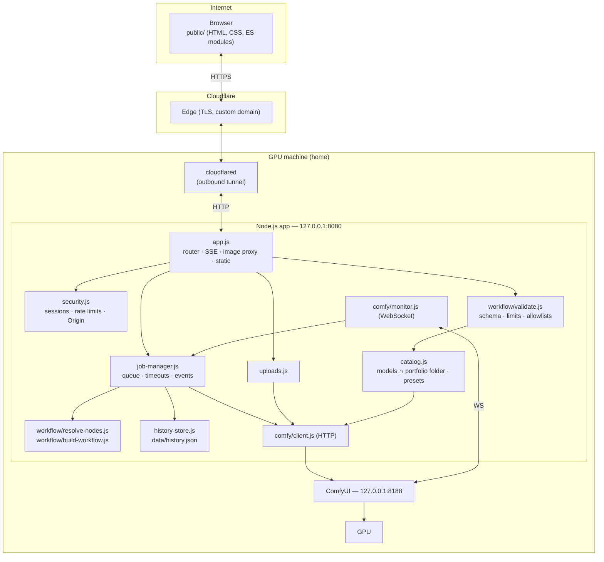
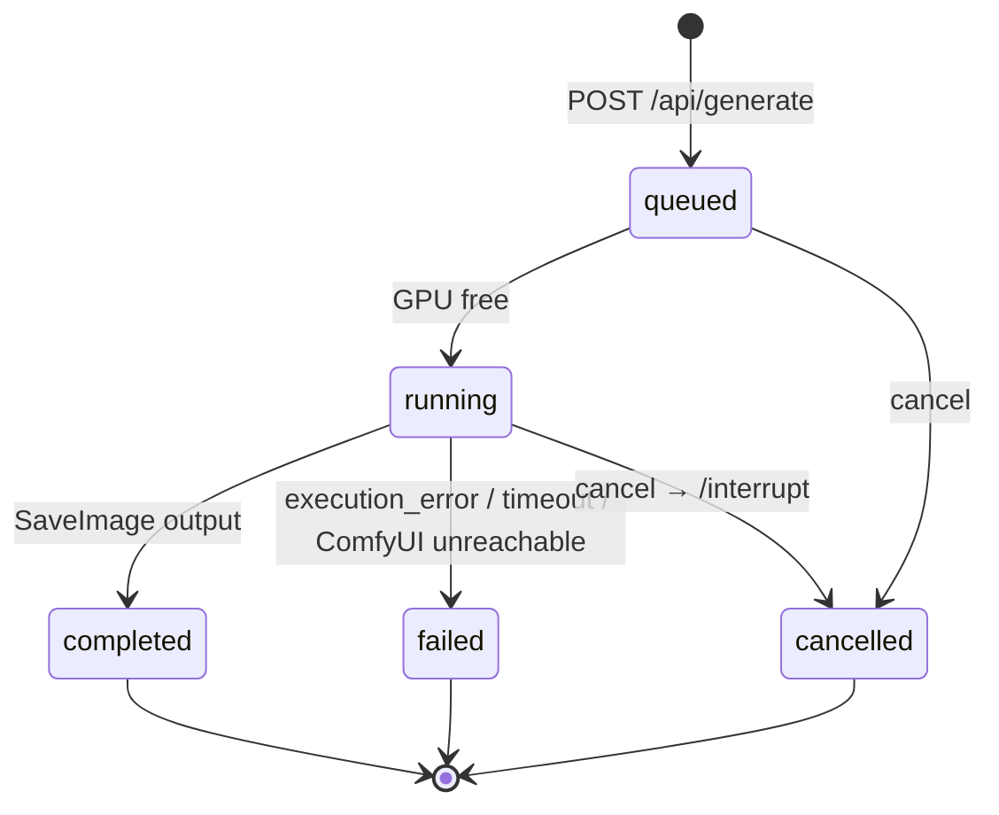
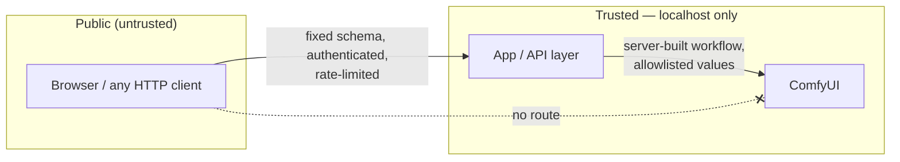

# Architecture

[한국어](architecture.md) | **English**

This document explains how ComfyUI Mobile Studio is put together, how a request travels through the system, and why the boundaries are where they are.

## 1. Components



| Module | Responsibility |
|---|---|
| `server/config.js` | Reads `.env`, validates values, refuses unsafe setups (no `ACCESS_TOKEN`, malformed origin, …). |
| `server/app.js` | HTTP routes, SSE stream per job, streaming image proxy, static files, security headers. |
| `server/security.js` | Access-token sign-in, HMAC-signed session cookies, bearer API key, fixed-window rate limiter, Origin (CSRF) check. |
| `server/catalog.js` | Asks ComfyUI (`/object_info`) which checkpoints, LoRAs, samplers and schedulers exist; publishes only the checkpoints/LoRAs inside the dedicated `portfolio` sub-folder (`MODEL_FOLDER`) or listed in `config/models.json`; loads presets, prompt tags and blocked terms. Cached for 60 s. |
| `server/workflow/validate.js` | Turns an untrusted JSON body into normalized parameters, or rejects it. |
| `server/workflow/resolve-nodes.js` | Finds the nodes the app needs **by their role in the graph** (see §4). |
| `server/workflow/build-workflow.js` | Pure function: template + roles + parameters → API-format workflow. |
| `server/job-manager.js` | Single-GPU job runner with a bounded queue; follows ComfyUI events; timeouts; cancel; saves results to the gallery. |
| `server/comfy/client.js` | Thin wrapper over the ComfyUI endpoints actually used. |
| `server/comfy/monitor.js` | One persistent WebSocket to ComfyUI, reconnecting with exponential backoff. |
| `server/history-store.js` | Recent results (metadata only), written atomically. |
| `server/uploads.js` | Reference-image uploads: magic-byte type check, random names, forwarded to ComfyUI's input folder. |
| `public/js/*` | UI modules: `api` (fetch + timeout + response checks), `i18n` (Korean default / English), `status`, `form`, `generate` (SSE + polling fallback), `gallery`, `reference`, `pose-editor`. |

## 2. Public API

All routes except `health`, `session`, `login` and `logout` require a session cookie (or `Authorization: Bearer <API_KEY>`). All `POST`/`DELETE` routes require a same-origin `Origin` header.

| Method & path | Purpose |
|---|---|
| `GET /api/health` | `{ status, comfyui: online/offline }` (+ queue info when signed in) |
| `GET /api/session` · `POST /api/login` · `POST /api/logout` | Session handling |
| `GET /api/catalog` | Models, LoRAs, samplers, sizes, presets, limits, feature flags, defaults |
| `POST /api/generate` | Validate and enqueue a job → `202 { id, status, … }` |
| `GET /api/jobs/:id` | Job snapshot (polling fallback) |
| `GET /api/jobs/:id/events` | Server-Sent Events: `job` (status/progress) and `preview` (data-URL frames) |
| `POST /api/jobs/:id/cancel` | Remove from queue or interrupt |
| `GET /api/gallery` · `DELETE /api/gallery/:id` | Recent results / hide one |
| `GET /api/images/:jobId/:index[?variant=thumb][&download=1]` | Stream an output image (WebP thumbnail via ComfyUI's `preview` option) |
| `POST /api/uploads` · `GET /api/uploads/:id` | Reference image upload / preview |

There is intentionally **no** route that forwards to arbitrary ComfyUI paths.

## 3. Generation data flow

1. **Browser** — `form.js` collects values into a flat object; `generate.js` sets a synchronous `running` flag (blocks double taps) and `POST`s `/api/generate`.
2. **Security** — session check → Origin check → per-IP rate limit → body size cap (32 KB) → `415` unless JSON.
3. **Availability** — if ComfyUI does not answer `/system_stats`, respond `503` immediately instead of queuing a job that cannot run.
4. **Validation** (`validate.js`)
   - Unknown keys → `400` (`workflow`, `filename_prefix`, … can never get in).
   - Text: control characters stripped, length-capped, blocked terms rejected.
   - Checkpoint / LoRA / sampler / scheduler must be in the published catalog.
   - Width/height multiples of 64, pixel budget, steps/CFG/batch/hires ranges.
   - Seed `null` → cryptographically random seed on the server.
   - Output: `request` (what the user asked for, stored for *reuse settings*) and `params` (what gets injected: prompt joined with LoRA trigger words and preset text, negative joined with the preset negative and `SAFETY_NEGATIVE`).
5. **Queue** (`job-manager.js`) — if a job is running and `MAX_PENDING_JOBS` are waiting → `429` with `Retry-After`. Otherwise a job with a random 128-bit id is created and the browser gets `202`.
6. **Build** (`build-workflow.js`) — clone the template, write values into the resolved nodes, set a server-generated `filename_prefix` (`<OUTPUT_SUBFOLDER>/<date>/<job>`), insert LoRA/ControlNet nodes, prune the hires branch if disabled.
7. **Submit** — `POST /prompt` with the server's WebSocket `client_id`. ComfyUI's validation errors (`node_errors`) are condensed into one readable message.
8. **Follow** — `monitor.js` receives events for that `client_id`; `job-manager` filters by `prompt_id` and updates the job: `execution_start`, `executing` (stage name by node role, e.g. *Sampling*, *Hires sampling*, *Applying LoRA 1*), `progress` (step x / y), `executed` (collect `SaveImage` outputs), `execution_success`, `execution_error`, `execution_interrupted`. Binary preview frames are throttled (≤ 1 per 400 ms, ≤ 400 KB) and forwarded.
9. **Stream to browser** — `/api/jobs/:id/events` sends a `job` event on every change and `preview` events; heartbeats every 15 s keep proxies/tunnels from closing the stream; the stream closes after the final state.
10. **Result** — images are recorded (`filename`, `subfolder`, `type`) in memory and in `data/history.json`; the browser receives only `/api/images/:jobId/:index` URLs.

### Job lifecycle



## 4. Role-based workflow injection

ComfyUI node ids change whenever a workflow is edited and re-exported. Instead of hard-coding ids, `resolve-nodes.js` walks the graph backwards from the output:

```
SaveImage.images            ← VAEDecode
VAEDecode.samples           ← final KSampler
final KSampler.latent_image ← LatentUpscale* ← base KSampler   (⇒ hires pass present)
base KSampler.latent_image  ← EmptyLatentImage
base KSampler.positive      ← CLIPTextEncode   (positive prompt)
base KSampler.negative      ← CLIPTextEncode   (negative prompt)
base KSampler.model         ← … ← CheckpointLoaderSimple
```

If any role is missing the server **refuses to start** with a list of problems (instead of silently sending a half-configured graph). `npm run workflow:check` prints the mapping. A test renumbers every node id and asserts the same roles are found.

Graph edits done at request time:

- **LoRA chain** — `CheckpointLoader → LoraLoader₁ → … → LoraLoaderₙ`; then every input that consumed the checkpoint's MODEL/CLIP outputs is rewired to the last LoRA (the VAE output is untouched).
- **ControlNet** — `LoadImage (→ OpenposePreprocessor) → ControlNetApplyAdvanced(positive, negative)`; the samplers' `positive`/`negative` inputs are rewired to the ControlNet outputs.
- **Hires off** — `VAEDecode.samples` is pointed at the base sampler and everything not reachable from `SaveImage` is pruned (`pruneToAncestors`).

A test asserts that no link in any generated graph points at a missing node.

## 5. Reliability

| Situation | Handling |
|---|---|
| ComfyUI down before a request | `/api/health` → *Offline* pill, Generate disabled; `/api/generate` → `503` |
| ComfyUI down during a job | HTTP calls fail with a clear message; WebSocket reconnects with backoff (1 s → 15 s) |
| WebSocket message lost (e.g. reconnect at the wrong moment) | `/history/<prompt_id>` polled every 4 s as a safety net |
| Job silent for too long | Activity-based idle timeout (re-armed on every event; waits while the prompt is still *pending* in ComfyUI's own queue) + absolute ceiling → ComfyUI interrupt + `failed` |
| Browser event stream drops | Falls back to polling `GET /api/jobs/:id` every 2 s |
| Browser waits forever | 20-minute client ceiling, then cancel |
| Double click / impatient taps | Synchronous `running` flag + disabled button; server queue limit |
| Too many users | One running job, bounded waiting line, `429` with `Retry-After`, per-IP limits |
| Server restart | Gallery survives (`data/history.json`); running jobs are lost and the browser reports it |
| Upload id expired | Validation error; the UI clears the stale reference |

These rules carry over lessons from the original personal client (activity-based timeouts, `/history` fallback, reconnect-then-check), moved from the browser into the server.

## 6. Security boundary



- The only process reachable from outside is the app (through the tunnel). ComfyUI binds to loopback and has no tunnel route.
- Values that become file names or model names are allowlisted; output and upload names are generated by the server; images are addressed by job id + index.
- Sessions: `HttpOnly; SameSite=Strict; Secure` (behind HTTPS), HMAC-SHA256 signed, expiring; token comparisons are constant-time.
- Every response carries a strict CSP (no inline script, no third-party origins), `X-Frame-Options: DENY`, `nosniff`, `Referrer-Policy: no-referrer`.

## 7. Languages

The UI is Korean by default and can be switched to English (stored per browser). Static texts carry `data-i18n` keys that `public/js/i18n.js` fills in; data from the server (preset names, prompt-helper labels, size labels) may be `{ ko, en }` objects. The browser sends its language as an `X-Lang` header (`?lang=` for `EventSource`), and the server localizes error messages and progress stage names per request — messages are defined once as `L("한국어", "English")`.

## 8. Repository lineage

The original personal app was a single-page PWA that called ComfyUI directly from the phone over a private VPN, with a very large custom workflow and many personal tools. For the public edition:

- **Kept (ported)**: the design tokens, the phone-first Create/Result layout, checkpoint list from `/object_info`, LoRA rows with strength, seed/steps/CFG/sampler controls, style presets, pose editor, ControlNet reference with strength/end controls, the WebSocket reliability rules, the idea of finding nodes by role, `node_errors` reporting.
- **Rebuilt**: the server-side application layer (the original had none — only a static page server), request validation, authentication, job queue, SSE streaming, image proxy, tunnel-based remote access.
- **Left out**: personal data sets and tools not needed for a generic demo, and the large custom-node workflow (replaced by a core-nodes-only template so anyone can run it).
