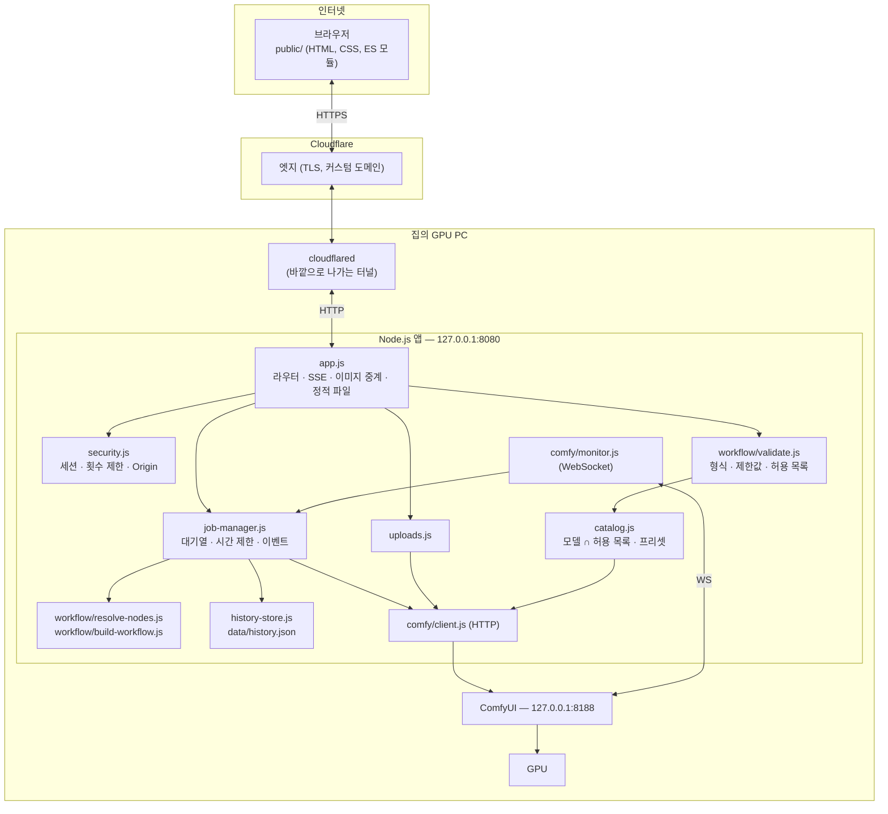
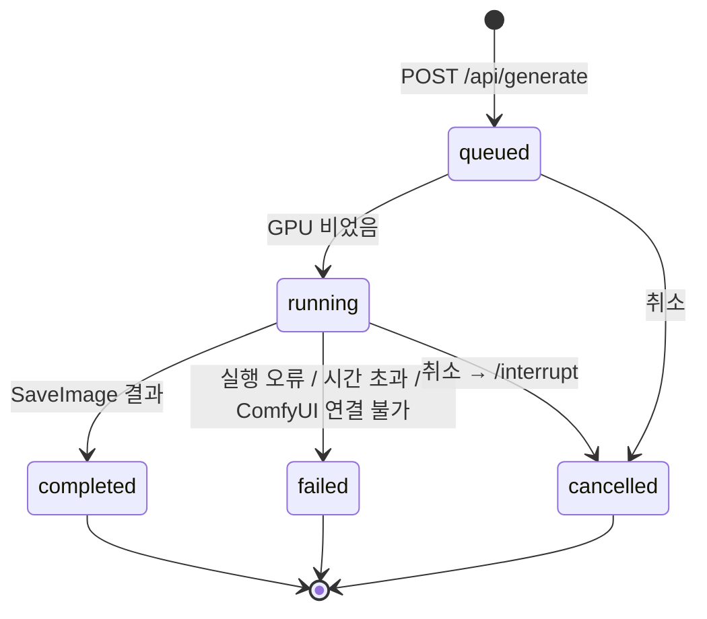
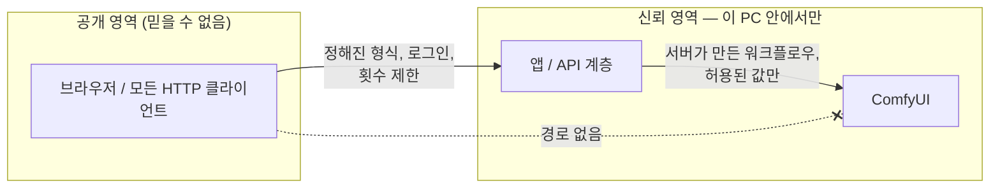

# 아키텍처

**한국어** | [English](architecture.en.md)

ComfyUI Mobile Studio가 어떻게 구성되어 있는지, 요청 하나가 시스템을 어떻게 지나가는지, 그리고 보안 경계를 왜 그 자리에 두었는지 설명합니다.

## 1. 구성 요소



| 모듈 | 역할 |
|---|---|
| `server/config.js` | `.env`를 읽고 값을 검사합니다. 위험한 설정(`ACCESS_TOKEN` 없음, 잘못된 주소 등)이면 시작을 거부합니다. |
| `server/app.js` | HTTP 라우트, 작업별 SSE 스트림, 이미지 중계, 정적 파일, 보안 헤더. |
| `server/security.js` | 접속 비밀번호 로그인, HMAC 서명 세션 쿠키, Bearer API 키, 고정 창 방식 요청 횟수 제한, Origin(CSRF) 확인. |
| `server/catalog.js` | ComfyUI(`/object_info`)에 설치된 체크포인트·LoRA·샘플러·스케줄러를 묻고, `config/models.json`과 겹치는 것만 남깁니다. 프리셋·프롬프트 키워드·금지어도 읽습니다. 60초 캐시. |
| `server/workflow/validate.js` | 믿을 수 없는 JSON 요청을 정리된 파라미터로 바꾸거나 거절합니다. |
| `server/workflow/resolve-nodes.js` | 앱에 필요한 노드를 **그래프상의 역할로** 찾습니다(§4). |
| `server/workflow/build-workflow.js` | 순수 함수: 템플릿 + 역할 + 파라미터 → API 형식 워크플로우. |
| `server/job-manager.js` | GPU 1건씩 처리하는 작업 실행기와 제한된 대기열. ComfyUI 이벤트를 따라가고, 시간 제한·취소를 처리하고, 결과를 갤러리에 저장합니다. |
| `server/comfy/client.js` | 실제로 쓰는 ComfyUI 엔드포인트만 감싼 얇은 클라이언트. |
| `server/comfy/monitor.js` | ComfyUI와 계속 연결된 WebSocket 하나. 끊기면 간격을 늘려 가며 다시 연결합니다. |
| `server/history-store.js` | 최근 결과(정보만) 저장. 원자적으로 기록합니다. |
| `server/uploads.js` | 참조 이미지 업로드: 매직 바이트로 형식 확인, 무작위 이름, ComfyUI input 폴더로 전달. |
| `public/js/*` | 화면 모듈: `api`(시간 제한 + 응답 확인), `i18n`(한국어 기본 / English), `status`, `form`, `generate`(SSE + 폴링 대체), `gallery`, `reference`, `pose-editor`. |

## 2. 공개 API

`health`, `session`, `login`, `logout`을 뺀 모든 라우트는 세션 쿠키(또는 `Authorization: Bearer <API_KEY>`)가 필요합니다. 모든 `POST`/`DELETE`는 같은 출처의 `Origin` 헤더가 있어야 합니다.

| 메서드 · 경로 | 용도 |
|---|---|
| `GET /api/health` | `{ status, comfyui: online/offline }` (로그인하면 대기열 정보 추가) |
| `GET /api/session` · `POST /api/login` · `POST /api/logout` | 세션 처리 |
| `GET /api/catalog` | 모델, LoRA, 샘플러, 크기, 프리셋, 제한값, 기능 여부, 기본값 |
| `POST /api/generate` | 검사 후 작업 등록 → `202 { id, status, … }` |
| `GET /api/jobs/:id` | 작업 상태 (폴링 대체 경로) |
| `GET /api/jobs/:id/events` | Server-Sent Events: `job`(상태/진행률), `preview`(data URL 미리보기) |
| `POST /api/jobs/:id/cancel` | 대기열에서 빼거나 실행 중단 |
| `GET /api/gallery` · `DELETE /api/gallery/:id` | 최근 결과 / 하나 숨기기 |
| `GET /api/images/:jobId/:index[?variant=thumb][&download=1]` | 결과 이미지 전달 (썸네일은 ComfyUI `preview` 옵션으로 WebP) |
| `POST /api/uploads` · `GET /api/uploads/:id` | 참조 이미지 업로드 / 미리보기 |

임의의 ComfyUI 경로로 넘겨주는 라우트는 일부러 **하나도 두지 않았습니다.**

## 3. 생성 데이터 흐름

1. **브라우저** — `form.js`가 입력값을 평평한 객체로 모으고, `generate.js`가 `running` 플래그를 즉시 세운 뒤(연속 탭 방지) `/api/generate`로 `POST`합니다.
2. **보안** — 세션 확인 → Origin 확인 → IP별 요청 횟수 제한 → 본문 크기 제한(32KB) → JSON이 아니면 `415`.
3. **가용성** — ComfyUI가 `/system_stats`에 답하지 않으면, 실행될 수 없는 작업을 쌓는 대신 즉시 `503`을 돌려줍니다.
4. **검사** (`validate.js`)
   - 모르는 항목 → `400` (`workflow`, `filename_prefix` 등은 절대 들어올 수 없음).
   - 글자: 제어 문자 제거, 길이 제한, 금지어 거절.
   - 체크포인트·LoRA·샘플러·스케줄러는 공개된 목록에 있어야 함.
   - 가로·세로 64의 배수, 픽셀 상한, 스텝·CFG·생성 개수·Hires 범위.
   - 시드가 `null`이면 서버가 암호학적 난수로 정함.
   - 결과: `request`(사용자가 요청한 값 — *이 설정으로 다시 만들기*용)와 `params`(실제로 넣을 값 — 프롬프트 + LoRA 트리거 단어 + 프리셋 문구, 네거티브 + 프리셋 네거티브 + `SAFETY_NEGATIVE`).
5. **대기열** (`job-manager.js`) — 실행 중인 작업이 있고 `MAX_PENDING_JOBS`만큼 기다리고 있으면 `Retry-After`와 함께 `429`. 아니면 128비트 무작위 ID로 작업을 만들고 `202`를 돌려줍니다.
6. **조립** (`build-workflow.js`) — 템플릿을 복제하고, 찾아 둔 노드에 값을 넣고, 저장 위치(`<OUTPUT_SUBFOLDER>/<날짜>/<작업>`)를 서버가 정하고, LoRA·ControlNet 노드를 끼워 넣고, Hires가 꺼져 있으면 그 가지를 잘라 냅니다.
7. **전송** — 서버의 WebSocket `client_id`로 `POST /prompt`. ComfyUI 검증 오류(`node_errors`)는 읽기 쉬운 한 줄로 요약합니다.
8. **따라가기** — `monitor.js`가 그 `client_id`의 이벤트를 받고, `job-manager`가 `prompt_id`로 걸러 작업을 갱신합니다: `execution_start`, `executing`(노드 역할에 따른 단계 이름 — 예: *이미지 생성 중*, *Hires 보정 중*, *LoRA 1 적용 중*), `progress`(스텝 x / y), `executed`(`SaveImage` 결과 모으기), `execution_success`, `execution_error`, `execution_interrupted`. 미리보기 프레임은 줄여서(400ms에 최대 1장, 400KB 이하) 전달합니다.
9. **브라우저로 전달** — `/api/jobs/:id/events`는 바뀔 때마다 `job` 이벤트를, 그리고 `preview` 이벤트를 보냅니다. 15초마다 보내는 신호로 프록시·터널이 연결을 끊지 않게 하고, 작업이 끝나면 스트림을 닫습니다.
10. **결과** — 이미지 정보(`filename`, `subfolder`, `type`)는 메모리와 `data/history.json`에 기록하고, 브라우저에는 `/api/images/:jobId/:index` 주소만 줍니다.

### 작업 상태 변화



## 4. 역할 기반 워크플로우 주입

ComfyUI 노드 번호는 워크플로우를 고쳐서 다시 내보낼 때마다 바뀝니다. 그래서 번호를 코드에 박아 두지 않고, `resolve-nodes.js`가 출력에서부터 그래프를 거꾸로 따라갑니다.

```
SaveImage.images               ← VAEDecode
VAEDecode.samples              ← 마지막 KSampler
마지막 KSampler.latent_image   ← LatentUpscale* ← 기본 KSampler   (⇒ Hires 단계 있음)
기본 KSampler.latent_image     ← EmptyLatentImage
기본 KSampler.positive         ← CLIPTextEncode   (프롬프트)
기본 KSampler.negative         ← CLIPTextEncode   (네거티브 프롬프트)
기본 KSampler.model            ← … ← CheckpointLoaderSimple
```

역할 하나라도 찾지 못하면 반쯤 설정된 그래프를 조용히 보내는 대신 문제 목록을 보여 주며 **서버가 시작을 거부**합니다. `npm run workflow:check`로 어떤 노드가 잡혔는지 볼 수 있고, 모든 노드 번호를 바꾼 그래프에서도 같은 역할을 찾는지 테스트로 확인합니다.

요청할 때 그래프를 이렇게 고칩니다.

- **LoRA 연결** — `CheckpointLoader → LoraLoader₁ → … → LoraLoaderₙ`으로 잇고, 체크포인트의 MODEL/CLIP 출력을 쓰던 모든 입력을 마지막 LoRA로 다시 연결합니다(VAE 출력은 그대로).
- **ControlNet** — `LoadImage (→ OpenposePreprocessor) → ControlNetApplyAdvanced(positive, negative)`를 넣고, 샘플러의 `positive`/`negative` 입력을 ControlNet 출력으로 바꿉니다.
- **Hires 끔** — `VAEDecode.samples`를 기본 샘플러로 돌리고, `SaveImage`에서 닿지 않는 노드는 모두 지웁니다(`pruneToAncestors`).

만들어진 그래프의 어떤 연결도 없는 노드를 가리키지 않는지 테스트로 확인합니다.

## 5. 안정성

| 상황 | 처리 |
|---|---|
| 요청 전에 ComfyUI가 꺼져 있음 | `/api/health` → *오프라인* 표시, 생성 버튼 비활성, `/api/generate` → `503` |
| 작업 중 ComfyUI가 꺼짐 | HTTP 호출이 분명한 메시지로 실패, WebSocket은 간격을 늘려 가며 재연결(1초 → 15초) |
| WebSocket 메시지 유실 (재연결 타이밍 등) | 4초마다 `/history/<prompt_id>`를 확인하는 안전망 |
| 작업이 너무 오래 조용함 | 활동 기반 시간 제한(이벤트마다 다시 감음, ComfyUI 자체 대기열에서 *대기* 중이면 기다림) + 절대 상한 → ComfyUI 중단 + `failed` |
| 브라우저 이벤트 스트림 끊김 | 2초마다 `GET /api/jobs/:id` 폴링으로 전환 |
| 브라우저가 끝없이 기다림 | 클라이언트 쪽 20분 상한 후 취소 |
| 중복 클릭 / 연속 탭 | 즉시 세우는 `running` 플래그 + 버튼 비활성, 서버 대기열 제한 |
| 사용자가 너무 많음 | 실행 1건, 제한된 대기열, `Retry-After`와 함께 `429`, IP별 제한 |
| 서버 재시작 | 갤러리는 유지(`data/history.json`), 실행 중이던 작업은 사라지고 브라우저가 알려 줌 |
| 업로드 ID 만료 | 검사 오류, 화면이 오래된 참조 이미지를 비움 |

이 규칙들은 원래 개인용 클라이언트에서 겪으며 만든 것(활동 기반 시간 제한, `/history` 대체 확인, 재연결 후 확인)을 브라우저에서 서버로 옮긴 것입니다.

## 6. 보안 경계



- 외부에서 닿는 프로세스는 (터널을 통한) 앱 하나뿐입니다. ComfyUI는 127.0.0.1에만 열려 있고 터널 경로도 없습니다.
- 파일 이름이나 모델 이름이 되는 값은 허용 목록으로 제한하고, 결과·업로드 파일 이름은 서버가 만들며, 이미지는 작업 ID + 번호로만 가리킵니다.
- 세션: `HttpOnly; SameSite=Strict; Secure`(HTTPS 뒤에서), HMAC-SHA256 서명, 만료 시간 있음. 비밀번호 비교는 시간이 일정합니다.
- 모든 응답에 엄격한 CSP(인라인 스크립트 없음, 외부 출처 없음), `X-Frame-Options: DENY`, `nosniff`, `Referrer-Policy: no-referrer`가 붙습니다.

## 7. 언어

화면은 기본이 한국어이고 English로 바꿀 수 있습니다(브라우저마다 기억). 정적 문구에는 `data-i18n` 키가 붙어 있어 `public/js/i18n.js`가 채우고, 서버 데이터(프리셋 이름, 프롬프트 도우미 표시 이름, 크기 이름)는 `{ ko, en }` 객체일 수 있습니다. 브라우저는 언어를 `X-Lang` 헤더(`EventSource`는 `?lang=`)로 보내고, 서버는 요청마다 오류 메시지와 진행 단계 이름을 그 언어로 돌려줍니다 — 메시지는 `L("한국어", "English")`로 한 번에 정의합니다.

## 8. 저장소의 뿌리

원래 개인용 앱은 휴대폰에서 사설 VPN으로 ComfyUI를 직접 부르는 단일 페이지 PWA였고, 아주 큰 커스텀 워크플로우와 개인용 도구가 많았습니다. 공개 버전에서는 다음과 같이 정리했습니다.

- **가져온 것(이식)**: 디자인 토큰, 휴대폰 우선의 만들기/결과 화면 구성, `/object_info` 기반 체크포인트 목록, LoRA 행과 강도, 시드·스텝·CFG·샘플러 설정, 스타일 프리셋, 포즈 에디터, 강도·적용 구간이 있는 ControlNet 참조, WebSocket 안정성 규칙, 역할로 노드를 찾는 아이디어, `node_errors` 보고.
- **새로 만든 것**: 서버 쪽 애플리케이션 계층(원본에는 정적 페이지 서버뿐이었음), 요청 검사, 로그인, 작업 대기열, SSE 스트리밍, 이미지 중계, 터널 기반 원격 접속, 한/영 전환.
- **뺀 것**: 일반 데모에 필요 없는 개인 데이터와 도구, 커스텀 노드가 많은 대형 워크플로우(누구나 실행할 수 있도록 기본 노드만 쓰는 템플릿으로 교체).
